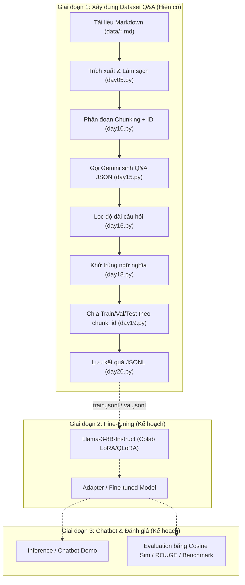

# Báo Cáo Phân Tích Toàn Diện Project QA Builder

> **Tài liệu phân tích hiện trạng dự án, kiến trúc source code, đánh giá kỹ thuật và lộ trình hoàn thiện.**

---

## 📌 Tóm Tắt Nội Dung Tài Liệu

* **Tổng quan đề tài:** Làm rõ bài toán, mục tiêu SFT, vai trò của dataset và Llama 3.
* **Phân tích source code:** Chi tiết chức năng từng file ([`main.py`](file:///d:/GITHUB/qa-builder/main.py), [`day02.py`](file:///d:/GITHUB/qa-builder/day02.py) $\rightarrow$ [`day22.py`](file:///d:/GITHUB/qa-builder/day22.py)) và sơ đồ luồng dữ liệu Mermaid.
* **Quy trình xây dựng Dataset:** Chi tiết tiền xử lý, phân chunk, gọi Gemini API, lọc câu hỏi, khử trùng bằng `SentenceTransformer` và chia train/val/test theo `chunk_id`.
* **Phân tích Fine-tuning:** Nêu rõ hiện trạng chưa có code fine-tune, đề xuất phương pháp QLoRA/Unsloth và bộ hyperparameters tối ưu cho Colab GPU T4.
* **Phân tích Chatbot & Prompt Template:** Cấu trúc hội thoại chuẩn theo Llama-3 Chat Template.
* **Phân tích Evaluation:** Ứng dụng Cosine Similarity để so sánh câu trả lời của mô hình với Reference Answer, cùng các trường hợp bẫy (Cosine Sim cao nhưng câu trả lời sai).
* **Lỗi tiềm ẩn & Đánh giá mức độ hoàn thành:** Bảng trạng thái chi tiết theo các mức ✅ / 🟡 / ❌ / 🔴.
* **Giải thích dễ hiểu cho người mới & Roadmap:** Hướng dẫn trực quan và lộ trình 6 bước kỹ thuật từ trạng thái hiện tại đến khi hoàn thiện đề tài.

---

## 1. Tổng Quan Đề Tài

### 1.1. Bài toán và mục tiêu
* **Bài toán cần giải quyết:** Tự động hóa quy trình xây dựng tập dữ liệu Hỏi - Đáp (Question & Answering - Q&A Dataset) chất lượng cao từ tài liệu học thuật định dạng Markdown (`.md`), giải quyết bài toán thiếu hụt dữ liệu huấn luyện tiếng Việt chuyên ngành cho các mô hình ngôn ngữ lớn (LLM).
* **Mục tiêu cuối cùng:** Sử dụng dataset Q&A được trích xuất để **Fine-tune mô hình mã nguồn mở Llama 3**, biến mô hình thành một trợ lý ảo (Chatbot) chuyên gia về Trí tuệ Nhân tạo, đồng thời xây dựng hệ thống đánh giá định lượng năng lực của mô hình sau khi huấn luyện.

### 1.2. Vai trò của các thành phần chính
* **Dataset Q&A:** Đóng vai trò là dữ liệu huấn luyện có giám sát (Supervised Fine-Tuning - SFT). Dataset này cung cấp tri thức đặc thù theo giáo trình và định hình phong cách phản hồi chuẩn xác cho mô hình.
* **Llama 3 & Fine-tuning:** 
  * **Trạng thái thực tế trong codebase:** Hiện tại trong repo **hoàn toàn CHƯA CÓ code fine-tuning Llama 3**. 
  * Dự án đang dừng ở giai đoạn hoàn thiện các module tạo dữ liệu bằng Google Gemini API (`gemini-2.5-flash`). Việc áp dụng kỹ thuật LoRA/QLoRA trên Llama 3 là mục tiêu của giai đoạn kế tiếp.

---

## 2. Cấu Trúc Source Code & Luồng Xử Lý

### 2.1. Cấu trúc thư mục & tập tin

```text
qa-builder/
├── .env                       # Lưu API key bảo mật (GEMINI_API_KEY)
├── .gitignore                 # Bỏ qua môi trường ảo, cache và logs
├── README.md                  # Tài liệu hướng dẫn cài đặt cơ bản
├── PROJECT_ANALYSIS.md        # Báo cáo phân tích toàn diện project
├── main.py                    # File CLI entrypoint (mới ở mức khung cơ bản)
├── chunker.py                 # File nháp gom hàm chunking
├── sample.txt                 # File test đọc text đơn giản
├── data/                      # Thư mục chứa tài liệu Markdown gốc
│   ├── Book_Artificial_Intelligence_v2.md (~4.0 MB)
│   ├── GT-tri-tue-nhan-tao-1.md (~155 KB)
│   ├── giao-trinh-ttnt.md (~560 KB)
│   └── sample.md (~297 B)
├── JSONL/                     # Thư mục lưu trữ dataset đầu ra dạng JSON Lines
│   └── qa.jsonl               # File kết quả mẫu (chứa 2 mẫu thử)
├── logs/                      # Log hoạt động và biến đếm request
│   └── request_count.json     # Ghi lại số lần gọi Gemini API
├── day02.py -> day22.py       # Chuỗi file code theo tiến độ phát triển từng ngày
└── test_func/                 # Thư mục chứa các hàm kiểm thử đơn vị độc lập
```

---

### 2.2. Bảng phân tích chi tiết vai trò từng file

| Tên file | Chức năng chi tiết |
| :--- | :--- |
| [`main.py`](file:///d:/GITHUB/qa-builder/main.py) | Nhận tham số `--input-dir` và `--output-dir` từ dòng lệnh, duyệt danh sách các file `.md`. **Hiện tại chỉ in ra tên file, chưa tích hợp pipeline**. |
| [`chunker.py`](file:///d:/GITHUB/qa-builder/chunker.py) | File khởi tạo dở dang, import `extract_md` từ `day04` và có hàm `count_word`. |
| [`day02.py`](file:///d:/GITHUB/qa-builder/day02.py) | Đọc [`sample.txt`](file:///d:/GITHUB/qa-builder/sample.txt), đếm số dòng và số từ cơ bản. |
| [`day03.py`](file:///d:/GITHUB/qa-builder/day03.py) | Hàm `extract_md()`: Dùng Regex loại bỏ Heading Markdown (`#`, `##`), gom thành đoạn văn thô. |
| [`day04.py`](file:///d:/GITHUB/qa-builder/day04.py) | Tách nhỏ thành hàm [`is_heading()`](file:///d:/GITHUB/qa-builder/day04.py#L4-L5) và [`clean_paragraph()`](file:///d:/GITHUB/qa-builder/day04.py#L7-L17) để chuẩn hóa đoạn văn. |
| [`day05.py`](file:///d:/GITHUB/qa-builder/day05.py) | Định nghĩa dataclass [`TextUnit`](file:///d:/GITHUB/qa-builder/day05.py#L6-L10) (gồm `text`, `source_file`, `section_title`) giúp giữ ngữ cảnh heading cho từng đoạn văn. |
| [`day06.py`](file:///d:/GITHUB/qa-builder/day06.py) | Thử nghiệm trích xuất `TextUnit` và đếm từ trên file thực tế `data/giao-trinh-ttnt.md`. |
| [`day07.py`](file:///d:/GITHUB/qa-builder/day07.py) | Hàm `chunk_text()` cơ bản: Gom các `TextUnit` thành chunk với ngưỡng từ cố định (mặc định 300 từ). |
| [`day08.py`](file:///d:/GITHUB/qa-builder/day08.py) | Thêm cơ chế **Sliding Window (Overlap)**: `overlap_ratio=0.15` (15%) giúp ngữ cảnh giữa 2 chunk liên tiếp không bị đứt đoạn. |
| [`day09.py`](file:///d:/GITHUB/qa-builder/day09.py) | Giải quyết trường hợp đoạn văn dài vượt quá `chunk_size` bằng hàm `split_sentences()` và `split_by_word()`. |
| [`day10.py`](file:///d:/GITHUB/qa-builder/day10.py) | **Module chunking hoàn chỉnh**: Định nghĩa dataclass [`Chunk`](file:///d:/GITHUB/qa-builder/day10.py#L13-L19) (`chunk_id`, `text`, `source_file`, `word_count`), tách câu, tách từ và phân chunk an toàn có gán mã định danh dạng `{filename}_chunk0001`. |
| [`day11.py`](file:///d:/GITHUB/qa-builder/day11.py) | Kết nối Google Gemini API với SDK mới `google-genai`, dùng model `gemini-2.5-flash`. |
| [`day12.py`](file:///d:/GITHUB/qa-builder/day12.py) | Viết prompt đầu tiên gửi văn bản chunk sang Gemini để tạo 3 cặp Q&A dạng văn bản tự do. |
| [`day13.py`](file:///d:/GITHUB/qa-builder/day13.py) | Cải tiến prompt để ép Gemini trả về định dạng chuẩn **JSON** (`{"qa_pairs": [{"question": "...", "answer": "..."}]}`). |
| [`day14.py`](file:///d:/GITHUB/qa-builder/day14.py) | Bổ sung xử lý ngoại lệ: `try - except JSONDecodeError, KeyError` khi Gemini trả về JSON không hợp lệ. |
| [`day15.py`](file:///d:/GITHUB/qa-builder/day15.py) | **Gọi API có khả năng phục hồi**: Hàm [`call_with_retry()`](file:///d:/GITHUB/qa-builder/day15.py#L62-L94) áp dụng cơ chế **Exponential Backoff** khi bị rate limit, đồng thời lưu đếm tổng request vào [`logs/request_count.json`](file:///d:/GITHUB/qa-builder/logs/request_count.json). |
| [`day16.py`](file:///d:/GITHUB/qa-builder/day16.py) | Lọc chất lượng câu hỏi bằng hàm [`filter_qa()`](file:///d:/GITHUB/qa-builder/day16.py#L1-L19): Loại bỏ các câu hỏi quá ngắn (`min_words < 5`). |
| [`day17.py`](file:///d:/GITHUB/qa-builder/day17.py) | Thử nghiệm embedding và đo độ tương đồng ngữ nghĩa bằng `sentence-transformers` với model `all-MiniLM-L6-v2`. |
| [`day18.py`](file:///d:/GITHUB/qa-builder/day18.py) | Hàm [`remove_duplicate_questions()`](file:///d:/GITHUB/qa-builder/day18.py#L7-L37): Dùng Cosine Similarity (`threshold = 0.9`) để loại bỏ các câu hỏi trùng lặp ngữ nghĩa. |
| [`day19.py`](file:///d:/GITHUB/qa-builder/day19.py) | Hàm [`split_dataset()`](file:///d:/GITHUB/qa-builder/day19.py#L5-L61): Chia dữ liệu theo tỷ lệ 8:1:1 **theo từng `chunk_id`** để chống rò rỉ dữ liệu (Data Leakage). |
| [`day20.py`](file:///d:/GITHUB/qa-builder/day20.py) | Hàm [`write_jsonl()`](file:///d:/GITHUB/qa-builder/day20.py#L3-L11): Xuất danh sách Q&A ra file `.jsonl` chuẩn định dạng huấn luyện NLP. |
| [`day22.py`](file:///d:/GITHUB/qa-builder/day22.py) | Hàm [`setup_logger()`](file:///d:/GITHUB/qa-builder/day22.py#L6-L34): Cấu hình ghi log ra cả console và file [`logs/run.log`](file:///d:/GITHUB/qa-builder/logs/run.log). |
| Thư mục [`test_func/`](file:///d:/GITHUB/qa-builder/test_func) | Chứa các bản trích xuất riêng lẻ của các hàm trên (như `splitter.py`, `write_jsonl.py`, `filter_qa.py`...) để kiểm thử đơn vị độc lập. |

---

### 2.3. Sơ đồ luồng dữ liệu (Data Flow)



---

## 3. Phân Tích Quá Trình Xây Dựng Dataset Q&A

1. **Nguồn dữ liệu đầu vào:**
   * Các file Markdown trong thư mục [`data/`](file:///d:/GITHUB/qa-builder/data): `Book_Artificial_Intelligence_v2.md` (~4.0 MB), `GT-tri-tue-nhan-tao-1.md` (~155 KB), `giao-trinh-ttnt.md` (~560 KB), và `sample.md`.
2. **Phương pháp tạo Q&A:**
   * Áp dụng kỹ thuật **LLM Synthetic Data Generation**: Gửi từng đoạn văn bản `chunk.text` kèm prompt chỉ định sang Gemini API (`gemini-2.5-flash`), yêu cầu sinh 3 câu hỏi và câu trả lời bám sát nội dung, trả về dạng JSON (xem [`day15.py:L97-L121`](file:///d:/GITHUB/qa-builder/day15.py#L97-L121)).
3. **Tiền xử lý văn bản (Text Preprocessing):**
   * Loại bỏ ký hiệu heading Markdown (`#`, `##`) nhưng vẫn lưu lại tiêu đề mục (`section_title`).
   * Chuẩn hóa khoảng trắng và dòng trống ([`clean_paragraph`](file:///d:/GITHUB/qa-builder/day05.py#L21-L26)).
   * Tách nhỏ các câu quá dài bằng Regex tách câu (`.`, `!`, `?`).
4. **Loại bỏ trùng lặp và lọc dữ liệu lỗi:**
   * Đã có code loại câu hỏi ngắn dưới 5 từ ([`filter_qa` trong day16.py](file:///d:/GITHUB/qa-builder/day16.py#L1-L19)).
   * Đã có code khử câu hỏi trùng ngữ nghĩa bằng `SentenceTransformer` với Cosine Similarity > 0.9 ([`remove_duplicate_questions` trong day18.py](file:///d:/GITHUB/qa-builder/day18.py#L7-L37)).
   * Đã có xử lý ngoại lệ JSON hỏng và lỗi kết nối API Gemini ([`day14.py`](file:///d:/GITHUB/qa-builder/day14.py) & [`day15.py`](file:///d:/GITHUB/qa-builder/day15.py)).
5. **Số lượng mẫu hiện có:**
   * Trong thư mục [`JSONL/qa.jsonl`](file:///d:/GITHUB/qa-builder/JSONL/qa.jsonl) hiện mới chỉ có **2 mẫu ghi thử (Q1, Q2)**. Chưa chạy pipeline trên toàn bộ file sách trong `data/`.
6. **Format / Schema dữ liệu:**
   ```json
   {"question": "...", "answer": "...", "chunk_id": "..."}
   ```
7. **Phân chia Train / Validation / Test:**
   * Thuật toán [`split_dataset()`](file:///d:/GITHUB/qa-builder/day19.py#L5-L61) chia tỷ lệ 80% - 10% - 10% **dựa trên `chunk_id`** (thay vì xáo trộn từng câu lẻ).
8. **Đánh giá nguy cơ Data Leakage & Chất lượng:**
   * *Data Leakage:* Đã được phòng tránh tốt về mặt thuật toán nhờ phân chia theo `chunk_id` (các câu hỏi sinh từ cùng 1 chunk sẽ không bị rò rỉ giữa train và test).
   * *Chất lượng:* Cần theo dõi để tránh hiện tượng mô hình sinh câu hỏi chung chung hoặc hallucination.

---

## 4. Phân Tích Phần Fine-Tuning

* **Mô hình mục tiêu:** Llama 3 (ví dụ `meta-llama/Meta-Llama-3-8B-Instruct` hoặc `Llama-3.2-3B`).
* **Trạng thái thực tế:** **CHƯA CÓ CODE FINE-TUNING** trong repository.
* **Phương pháp đề xuất:**
  * **QLoRA (4-bit Quantized Low-Rank Adaptation)** kết hợp thư viện `Unsloth` hoặc `PEFT` + `TRL` (`SFTTrainer`).
  * Tối ưu hóa để huấn luyện trực tiếp trên GPU miễn phí của Google Colab (Tesla T4 15GB VRAM).
* **Bộ siêu tham số (Hyperparameters) khuyến nghị:**
  * `batch_size`: 2 hoặc 4, `gradient_accumulation_steps`: 4
  * `learning_rate`: 2e-4
  * `lr_scheduler_type`: `"cosine"`
  * `epochs`: 3
  * `lora_r`: 16, `lora_alpha`: 32, `lora_dropout`: 0.05
  * `max_seq_length`: 1024 hoặc 2048

---

## 5. Phân Tích Phần Chatbot

* **Trạng thái thực tế:** **CHƯA CÓ CODE CHATBOT** trong repository.
* **Quy trình xử lý chuẩn khi hoàn thiện:**
  1. Người dùng nhập câu hỏi vào giao diện (CLI hoặc Web UI như Gradio/Streamlit).
  2. Hệ thống định dạng prompt theo đúng chuẩn Llama 3 Chat Template:
     ```text
     <|begin_of_text|><|start_header_id|>system<|end_header_id|>
     Bạn là trợ lý AI chuyên về Trí tuệ Nhân tạo. Hãy trả lời ngắn gọn, chính xác.<|eot_id|>
     <|start_header_id|>user<|end_header_id|>
     {User Query}<|eot_id|>
     <|start_header_id|>assistant<|end_header_id|>
     ```
  3. Mô hình nạp LoRA adapter và sinh phản hồi với các tham số: `max_new_tokens=256-512`, `temperature=0.3 - 0.7`, `top_p=0.9`.

---

## 6. Phân Tích Evaluation & Cosine Similarity

### 6.1. Hiện trạng đánh giá
* **Test set:** Đã có thuật toán chia tách test set trong [`day19.py`](file:///d:/GITHUB/qa-builder/day19.py), nhưng chưa xuất ra file `test.jsonl` chính thức.
* **Pipeline đánh giá:** Chưa có code kiểm thử định lượng tự động cho chatbot.

### 6.2. Ứng dụng Cosine Similarity trong bài toán
* **Code hiện có:** Cosine Similarity mới chỉ được dùng trong [`day18.py`](file:///d:/GITHUB/qa-builder/day18.py) để **khử trùng lặp câu hỏi** khi tạo dataset.
* **Ứng dụng cho Evaluation:**
  1. Lấy từng câu hỏi trong tập `test.jsonl` có sẵn câu trả lời chuẩn ($Reference\_Answer$).
  2. Cho mô hình (sau khi fine-tune) sinh câu trả lời ($Predicted\_Answer$).
  3. Dùng mô hình Sentence Embedding (như `paraphrase-multilingual-mpnet-base-v2` hoặc `bkai-foundation-models/vietnamese-bi-encoder`) để mã hóa hai câu thành vector $\vec{u}$ và $\vec{v}$.
  4. Tính độ tương đồng Cosine:
     $$\text{Cosine Sim}(\vec{u}, \vec{v}) = \frac{\vec{u} \cdot \vec{v}}{\|\vec{u}\| \|\vec{v}\|}$$
  5. Tính điểm trung bình trên toàn tập test để đo lường mức độ bám sát kiến thức chuẩn của chatbot.

### 6.3. Những trường hợp Cosine Similarity cao nhưng câu trả lời vẫn SAI
1. **Đảo ngược ngữ nghĩa / Phủ định:**
   * *Reference:* "BFS **không** tìm được đường đi ngắn nhất trên đồ thị có trọng số âm."
   * *Predicted:* "BFS tìm được đường đi ngắn nhất trên đồ thị có trọng số âm."
   * $\rightarrow$ Câu từ giống nhau tới 95%, Cosine Similarity rất cao (> 0.9) nhưng bản chất kiến thức bị **sai hoàn toàn**.
2. **Sai lệch thông số, độ phức tạp thuật toán:**
   * *Reference:* "Độ phức tạp thời gian là $O(V + E)$."
   * *Predicted:* "Độ phức tạp thời gian là $O(V \times E)$."
   * $\rightarrow$ Vector embedding không phân biệt được ý nghĩa toán học của dấu cộng và dấu nhân.
3. **Trả lời lảng tránh, thiếu trọng tâm:**
   * Vector tương đồng cao do cùng chung chủ đề nhưng không trả lời thẳng vào câu hỏi.
   * *(Khuyến nghị)*: Nên kết hợp thêm **ROUGE-L**, **BLEU**, hoặc **LLM-as-a-Judge** (dùng Gemini/GPT-4 chấm điểm từ 1 đến 5).

---

## 7. Các Vấn Đề Kỹ Thuật Cần Lưu Ý

1. **Pipeline chưa nối kết ([`main.py`](file:///d:/GITHUB/qa-builder/main.py)):** Hiện tại `main.py` chỉ duyệt file, chưa gọi chuỗi xử lý từ `day05` đến `day20`.
2. **Embedding model tiếng Việt ([`day17.py`](file:///d:/GITHUB/qa-builder/day17.py), [`day18.py`](file:///d:/GITHUB/qa-builder/day18.py)):** Model `all-MiniLM-L6-v2` được huấn luyện chủ yếu trên tiếng Anh. Cần chuyển sang mô hình đa ngôn ngữ/tiếng Việt để đo ngữ nghĩa chính xác hơn.
3. **Mất cơ chế Overlap trong [`day10.py`](file:///d:/GITHUB/qa-builder/day10.py):** File hoàn thiện `day10.py` chưa tích hợp tham số `overlap_ratio` đã xây dựng ở `day08.py`.
4. **Xử lý tập dữ liệu nhỏ ([`day19.py`](file:///d:/GITHUB/qa-builder/day19.py)):** Nếu số chunk quá ít (< 10), phép chia `int()` làm tròn có thể làm tập val hoặc test bị rỗng.

---

## 8. Đánh Giá Mức Độ Hoàn Thành

| Hạng mục | Trạng thái | Ghi chú |
| :--- | :---: | :--- |
| **Đọc, parse Markdown & làm sạch Heading** | ✅ Đã hoàn thành | Hoàn thiện tại [`day04.py`](file:///d:/GITHUB/qa-builder/day04.py), [`day05.py`](file:///d:/GITHUB/qa-builder/day05.py) |
| **Phân đoạn văn bản (Chunking & ID)** | ✅ Đã hoàn thành | Hoàn thiện tại [`day09.py`](file:///d:/GITHUB/qa-builder/day09.py), [`day10.py`](file:///d:/GITHUB/qa-builder/day10.py) |
| **Tích hợp Gemini API sinh Q&A JSON** | ✅ Đã hoàn thành | Có Exponential Backoff & log request trong [`day15.py`](file:///d:/GITHUB/qa-builder/day15.py) |
| **Lọc và khử trùng câu hỏi (Deduplication)** | ✅ Đã hoàn thành | Đã có trong [`day16.py`](file:///d:/GITHUB/qa-builder/day16.py), [`day18.py`](file:///d:/GITHUB/qa-builder/day18.py) |
| **Chia tập dữ liệu Train/Val/Test** | ✅ Đã hoàn thành | Đã có trong [`day19.py`](file:///d:/GITHUB/qa-builder/day19.py) |
| **Ghi file JSONL** | ✅ Đã hoàn thành | Đã có trong [`day20.py`](file:///d:/GITHUB/qa-builder/day20.py) |
| **Gom toàn bộ thành pipeline CLI hoàn chỉnh** | 🟡 Đang làm/chưa hoàn thiện | File [`main.py`](file:///d:/GITHUB/qa-builder/main.py) chưa liên kết các hàm lại với nhau |
| **Chạy sinh dataset thực tế trên toàn bộ sách** | 🟡 Đang làm/chưa hoàn thiện | Mới có 4 file md trong `data/`, chưa chạy xuất full dataset |
| **Kịch bản Fine-tune Llama 3 (LoRA/QLoRA trên Colab)** | ❌ Chưa làm | Chưa có notebook hoặc script training |
| **Giao diện/Inference Chatbot** | ❌ Chưa làm | Chưa có code inference chatbot |
| **Evaluation pipeline (Cosine Sim & Metrics)** | ❌ Chưa làm | Chưa có script so sánh câu trả lời chatbot vs test set |
| **Tích hợp Overlap & Embedding tiếng Việt** | 🔴 Cần sửa | Cần mang overlap vào `day10.py` và đổi model embedding sang đa ngôn ngữ |

---

## 9. Giải Thích Dự Án Bằng Ngôn Ngữ Dễ Hiểu

Hãy hình dung dự án này giống như quy trình **"Biến sách giáo trình thành một gia sư AI"** qua 4 bước:

1. **Bước 1 - Cắt sách thành từng mẩu nhỏ (Chunking):** Cuốn sách rất dài, máy tính không thể đọc một lần hết cả cuốn. Ta cắt sách thành từng đoạn khoảng 300 từ và đánh số định danh (như `giao-trinh-ttnt_chunk0001`).
2. **Bước 2 - Nhờ "chuyên gia" Gemini soạn bộ câu hỏi ôn tập (Tạo Dataset):** Gửi từng đoạn văn bản cho Gemini để tự động tạo ra 3 câu hỏi kèm câu trả lời chuẩn. Lọc bỏ các câu hỏi quá ngắn hoặc trùng lặp ý, rồi chia ra làm 3 phần: Học (Train - 80%), Kiểm tra (Val - 10%), Thi tốt nghiệp (Test - 10%).
3. **Bước 3 - Huấn luyện mô hình Llama 3 (Fine-tuning):** Dạy mô hình Llama 3 học bộ câu hỏi - câu trả lời ở trên bằng kỹ thuật QLoRA để mô hình nắm vững kiến thức chuyên ngành.
4. **Bước 4 - Đánh giá năng lực (Evaluation):** Cho mô hình trả lời bộ đề thi (Test set), sau đó so sánh câu trả lời của mô hình với đáp án mẫu bằng công thức toán học **Cosine Similarity** xem mức độ tương đồng đạt bao nhiêu %.

---

## 10. Lộ Trình Hoàn Thiện Dự Án (Roadmap)

```text
[1. Dataset Pipeline] ➔ [2. Chạy tạo Dataset Full] ➔ [3. Fine-tune Llama 3] ➔ [4. Chatbot Demo] ➔ [5. Evaluation] ➔ [6. Báo cáo]
```

### Bước 1: Chuẩn hóa Pipeline sinh Dataset
* Tích hợp toàn bộ các hàm từ `day05.py` $\rightarrow$ `day20.py` vào `main.py` hoặc thư mục `src/`.
* Cập nhật mô hình Embedding sang `paraphrase-multilingual-MiniLM-L12-v2`.
* Tích hợp cơ chế Overlap đầy đủ vào bộ phân đoạn chunk.

### Bước 2: Chạy sinh Dataset thực tế & Kiểm tra chất lượng
* Chạy toàn bộ file trong `data/` qua `main.py` để thu về khoảng 500 - 1500 mẫu Q&A chất lượng.
* Xuất ra các file: `train.jsonl`, `val.jsonl`, `test.jsonl`.

### Bước 3: Huấn luyện mô hình Llama 3 trên Google Colab
* Tạo Colab Notebook với GPU T4.
* Cài đặt `unsloth` / `trl` / `peft`.
* Load model Llama-3-8B-Instruct 4-bit, huấn luyện với `train.jsonl` và lưu lại LoRA adapter.

### Bước 4: Xây dựng Giao diện Chatbot Demo
* Viết script chạy inference nạp adapter đã train.
* Xây dựng giao diện web tương tác thời gian thực bằng `Gradio` hoặc `Streamlit`.

### Bước 5: Xây dựng Module Evaluation (Cosine Similarity & Metrics)
* Xây dựng file `evaluate.py`.
* Cho mô hình sinh câu trả lời trên tập `test.jsonl` và đo điểm Cosine Similarity so với câu trả lời mẫu.
* So sánh định lượng kết quả trước và sau khi Fine-tune.

### Bước 6: Hoàn thiện Báo cáo / Khóa Luận
* Trích xuất biểu đồ loss, bảng điểm Cosine Similarity và các ví dụ hội thoại thực tế để đưa vào báo cáo tổng kết.
